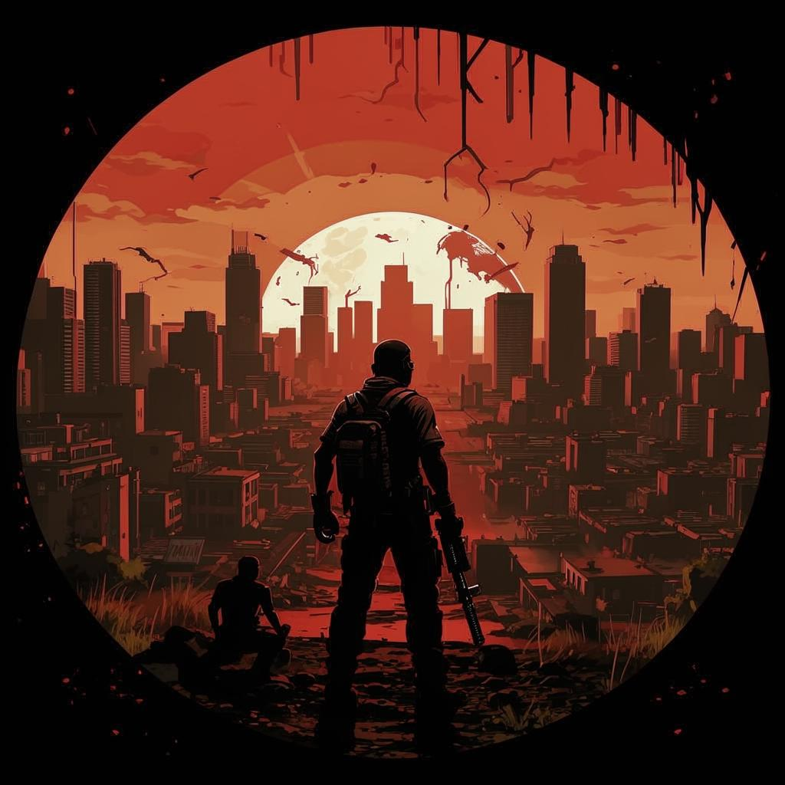

<div align="center">
    
</div>

<h1>LostAngeles</h1>


To build it, run `make build`. To run it, run the following commands to make a symbolic link in your server data directory:

```dos
cd /d [PATH TO THIS RESOURCE]
mklink /d X:\cfx-server-data\resources\[local]\LostAngeles Dist
```

Afterwards, you can use `ensure LostAngeles` in your server.cfg or server console to start the resource.